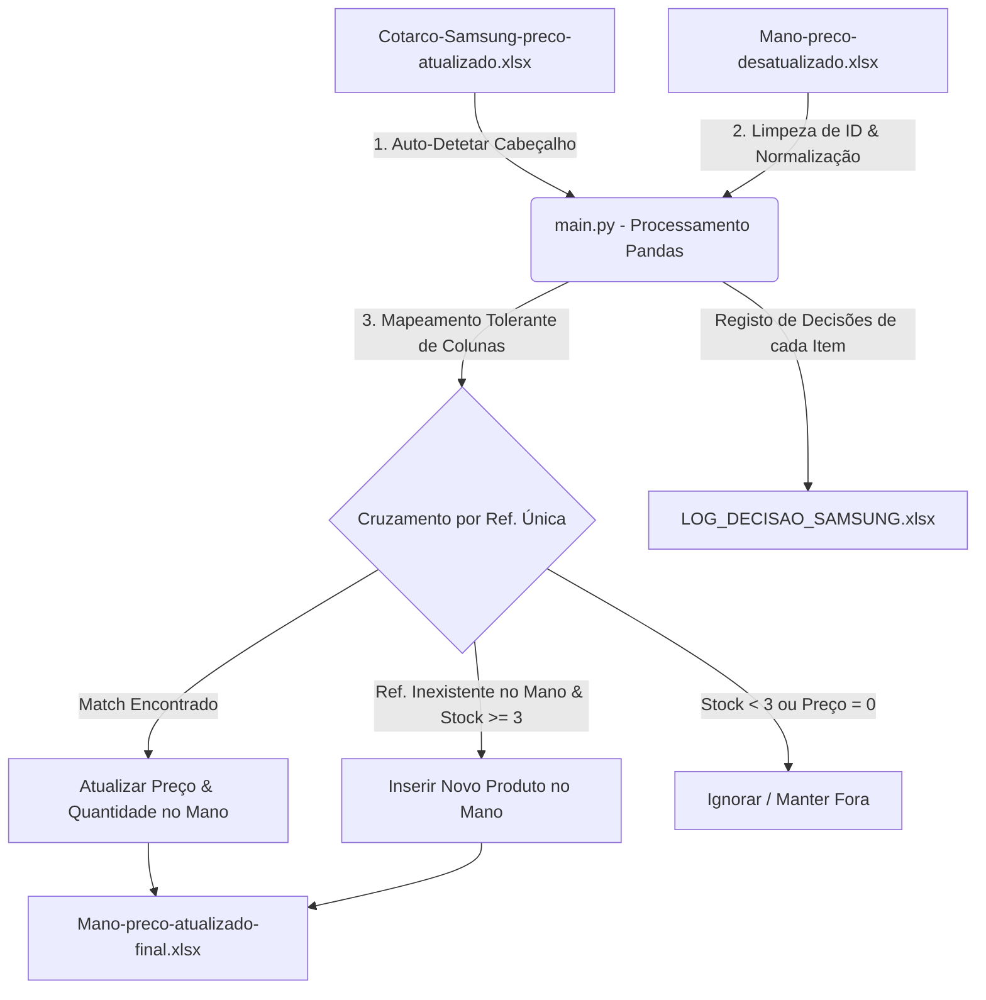

# 🏷️ Atualizador de Preços e Stock (Up Prices)

[](https://www.python.org/)
[](https://pandas.pydata.org/)
[](https://openpyxl.readthedocs.io/)

Este repositório contém um script robusto em Python (`main.py`) para **automação, saneamento e sincronização** de catálogos de produtos e listas de preços. Ele foi concebido para atualizar uma planilha de inventário desatualizada da loja (no formato **Mano**) com base em uma planilha de preços e stock atualizada fornecida pelo fornecedor (no formato **Samsung**).

---

## 🗺️ Fluxo de Trabalho (Workflow)

Abaixo está representado o fluxo lógico de processamento realizado pelo script:



---

## 🌟 Principais Funcionalidades

O script foi desenhado com foco em **tolerância a falhas** e **automação inteligente**, oferecendo:

*   🔍 **Deteção Automática de Cabeçalho:** Lê as primeiras linhas das planilhas para identificar automaticamente onde começam os dados reais (útil para planilhas de fornecedores com cabeçalhos decorativos ou linhas em branco).
*   🏷️ **Mapeamento Tolerante de Colunas:** Possui dicionários de sinónimos para as colunas. Se a coluna de referência se chamar `REF`, `SKU`, `Código` ou `Modelo`, o script reconhece e mapeia de forma autónoma.
*   🧼 **Saneamento Avançado de Dados:**
    *   **Ultra Clean:** Remove pontuação (exceto o traço), espaços adicionais e caracteres especiais das referências para garantir correspondências perfeitas (ex: `Galaxy-S21_FE` -> `GALAXY-S21FE`).
    *   **Limpeza de Preços:** Trata strings financeiras complexas, remove símbolos monetários e normaliza pontos e vírgulas.
*   ⚖️ **Regras de Negócio Integradas:**
    *   **Ativação/Inativação:** Produtos com stock **igual ou superior a 3** são definidos como ativos (`is_active = True`) e não-esgotados (`sold_out = False`).
    *   **Filtragem de Segurança:** Produtos novos com stock **inferior a 3** ou **preço nulo (zero)** são ignorados para evitar anúncios sem inventário real ou com erros de preço.
*   📋 **Log de Decisão Transparente:** Exporta uma planilha detalhada com o motivo pelo qual cada item do fornecedor foi adicionado, ignorado ou atualizado.

---

## 📂 Estrutura do Repositório

*   **`main.py`**: O script Python principal contendo toda a lógica de ETL (Extract, Transform, Load).
*   **`Cotarco-Samsung-preco-atualizado.xlsx`**: Planilha fonte com os dados mais recentes do fornecedor (preços, referências e stock).
*   **`Mano-preco-desatualizado.xlsx`**: Planilha destino contendo o catálogo atual (desatualizado) da loja.
*   **`Mano-preco-atualizado-final.xlsx`** *(Gerado)*: Planilha consolidada com preços atualizados, stock atualizado e novos produtos elegíveis inseridos.
*   **`LOG_DECISAO_SAMSUNG.xlsx`** *(Gerado)*: Relatório de auditoria que detalha o destino de cada referência lida na planilha do fornecedor.

---

## 🔧 Requisitos e Instalação

### Pré-requisitos
Certifique-se de que tem o **Python 3.8+** instalado no seu sistema.

### Instalar Dependências
Instale as bibliotecas necessárias via `pip`:

```bash
pip install pandas numpy openpyxl
```

---

## 🚀 Como Executar o Script

1.  Coloque os ficheiros de entrada na mesma diretoria do script `main.py`:
    *   `Cotarco-Samsung-preco-atualizado.xlsx` (Dados atualizados da Samsung)
    *   `Mano-preco-desatualizado.xlsx` (Dados desatualizados da Mano)
2.  Execute o script no terminal:

```bash
python main.py
```

3.  O script exibirá no ecrã um relatório em tempo real do processamento.
4.  Após a conclusão, abra a pasta e encontrará os ficheiros resultantes:
    *   `Mano-preco-atualizado-final.xlsx`
    *   `LOG_DECISAO_SAMSUNG.xlsx`

---

## 📊 Detalhes das Regras de Negócio Aplicadas

| Parâmetro / Caso | Condição de Stock | Ação no Ficheiro Destino (`Mano`) | Estado do Produto |
| :--- | :--- | :--- | :--- |
| **Produto Existente** | Stock $\ge 3$ | Atualiza preço e stock | `is_active = True`, `sold_out = False` |
| **Produto Existente** | Stock $< 3$ | Atualiza preço e stock | `is_active = False`, `sold_out = True` |
| **Produto Novo** | Stock $\ge 3$ | É inserido como nova linha no catálogo | `is_active = True`, `sold_out = False` |
| **Produto Novo** | Stock $< 3$ | **Ignorado** (registado no LOG) | Não adicionado |
| **Qualquer Produto** | Preço $= 0.0$ | **Ignorado** (registado no LOG) | Não adicionado / Não atualizado |

---

## 📈 Exemplo de Relatório de Consola

Ao finalizar com sucesso, o script gera um resumo como o seguinte:

```text
============================================================
  RELATÓRIO FINAL
============================================================
  Produtos Samsung lidos:        1450
  Produtos Mano lidos:           820
  Produtos atualizados:          710
  Novos produtos adicionados:    120
  Ignorados (já existia):        710
  Ignorados (stock < 3):         600
  Ignorados (preço = 0):         20

  Ficheiro final:  'Mano-preco-atualizado-final.xlsx'
  Log de decisões: 'LOG_DECISAO_SAMSUNG.xlsx'
============================================================
```

---

> 💡 **Dica:** Se precisar de suportar novos nomes de colunas gerados pelos seus fornecedores, basta editar as listas de candidatos dentro do dicionário `SAMSUNG_COL_MAP` no ficheiro `main.py`.
