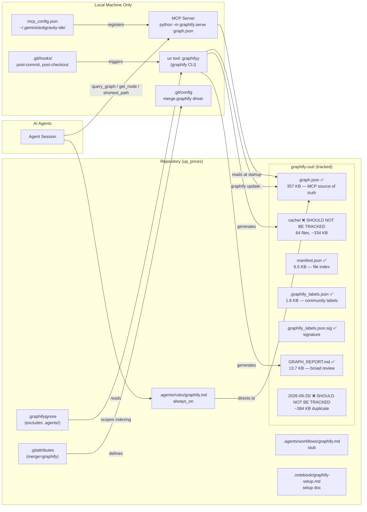

# Graphify Audit Report — Cotarco Commercial Manager / up_prices

> **Generated:** 2026-09-25T11:41:27+01:00  
> **Auditor:** Graphify Auditor Subagent (Subagent 3)  
> **Scope:** `c:\Users\MARKETING DESIGNER01\Downloads\up_prices`  
> **Mode:** READ-ONLY — no files were modified

---

## 1. Executive Summary

Graphify is **fully installed and functional** in this repository. The CLI binary, MCP server, git hooks, merge driver, agent rules, workflow stub, notebook setup doc, and `.graphifyignore` are all present and correctly configured. The graph itself is healthy: **414 nodes, 388 edges, 42 communities** generated from 32 source files across the `up_prices` codebase.

**Three critical issues require immediate attention:**

| # | Severity | Issue |
|---|----------|-------|
| 1 | 🔴 HIGH | **Cache directory (`graphify-out/cache/`) is fully committed to git** — 64 tracked files, ~334 KB of ephemeral hash-keyed blobs that should never be in version control. |
| 2 | 🔴 HIGH | **Dated snapshot directory (`graphify-out/2026-09-25/`) is committed** — duplicate snapshot that grows unboundedly with every run. |
| 3 | 🟡 MED | **`.gitignore` has no Graphify entries** — only Excel files are ignored. The gap between `.gitignore` and what should be excluded is wide and will worsen as the repository grows. |

**Additional findings:**

- `.graphifyignore` ignores only `.agents/` — the intended exclusion — but this single-entry file is not shared knowledge across agents, creating a documentation gap.
- The `graphify` MCP server is **registered correctly** in `mcp_config.json` but is **not listed** in the `agents.md` mandatory reading order, so agents arriving fresh may not know it exists.
- **No `graphify-out/wiki/` directory exists** — the agent rules reference it as an alternative navigation path, but it has never been generated.
- The workflow file (`.agents/workflows/graphify.md`) is a near-empty stub — it contains only a redirect to "the graphify skill" with no actionable detail.
- The git merge driver **is registered** in `.git/config` and points to a valid binary, but the driver definition lives in the local git config only, not in a committed `.gitconfig` or `setup` script, so collaborators must register it manually.

---

## 2. Current Graphify Artifacts Inventory

### 2.1 Configuration & Setup Files

| File | Size | Role | Git-tracked? |
|------|------|------|-------------|
| `.graphifyignore` | 10 B | Tells Graphify which paths to skip when indexing | ✅ Yes |
| `.gitattributes` | 39 B | Declares `graphify-out/graph.json merge=graphify` | ✅ Yes |
| `.agents/rules/graphify.md` | 947 B | `always_on` rule that instructs agents to use Graphify for codebase queries | ✅ Yes |
| `.agents/workflows/graphify.md` | 239 B | Stub workflow descriptor — minimal content | ✅ Yes |
| `.notebook/graphify-setup.md` | 1.95 KB | Human-readable setup walkthrough with commands and output metadata | ✅ Yes |

### 2.2 MCP Server Configuration

| File | Path | Status |
|------|------|--------|
| `mcp_config.json` | `~/.gemini/antigravity-ide/mcp_config.json` | ✅ Present, correctly configured |

**MCP entry (extracted):**
```json
"graphify": {
  "command": "C:/Users/MARKETING DESIGNER01/AppData/Roaming/uv/tools/graphifyy/Scripts/python.exe",
  "args": ["-m", "graphify.serve", "c:/Users/MARKETING DESIGNER01/Downloads/up_prices/graphify-out/graph.json"]
}
```

> [!NOTE]
> The MCP config path is hardcoded with an absolute local Windows path. This is expected for a developer workstation but means any collaborator must re-run `graphify antigravity install` on their own machine.

### 2.3 Binary / Runtime

| Component | Path | Status |
|-----------|------|--------|
| Python binary | `~\AppData\Roaming\uv\tools\graphifyy\Scripts\python.exe` | ✅ Present (confirmed by MCP config and notebook) |
| Package | `graphifyy` (note double-`y` spelling) via `uv tool` | ✅ Installed |

> [!IMPORTANT]
> The package name is `graphifyy` (with a double `y`), installed via `uv tool`. This is intentional (the PyPI package name differs from the command alias) but is a potential source of confusion for new developers. The notebook documents this correctly.

### 2.4 Git Hooks

| Hook File | Size | Status |
|-----------|------|--------|
| `.git/hooks/post-commit` | 10,998 B | ✅ Present — runs `graphify update .` after each commit |
| `.git/hooks/post-checkout` | 11,201 B | ✅ Present — runs `graphify update .` after branch checkouts |

> [!NOTE]
> Git hooks live in `.git/hooks/` which is **not tracked by git by default**. Any collaborator cloning the repository will not receive these hooks. They must re-run `graphify antigravity install` to install them. This is consistent with standard git behavior but represents an onboarding gap not documented in `agents.md` or `context.md`.

### 2.5 `graphify-out/` Directory — Full Inventory

**Summary statistics:**
- **Total files:** 81
- **Total tracked by git:** 81 (all files, including cache)
- **Total size on disk:** ~1.42 MB (1,451.4 KB)
- **Cache size:** ~334 KB
- **`graph.json` size:** ~357 KB

#### Root-level artifacts (`graphify-out/`)

| File | Size | Description | Essential? |
|------|------|-------------|-----------|
| `graph.json` | 357 KB | The active knowledge graph — nodes, edges, communities. Loaded by MCP server at startup. | ✅ **Essential** |
| `GRAPH_REPORT.md` | 13.7 KB | Human-readable architecture overview (414 nodes, 42 communities). Used by agents for broad review. | ✅ **Essential** |
| `manifest.json` | 6.5 KB | Index of all files processed by the last `graphify update` run | ✅ **Essential** |
| `.graphify_detect.json` | 22.4 KB | Language/framework detection results cached per run | ⚠️ **Borderline** — regenerated freely, but enables faster re-runs |
| `.graphify_analysis.json` | 5.1 KB | Analysis metadata from the last run | ⚠️ **Borderline** |
| `.graphify_labels.json` | 1.8 KB | Community label assignments | ✅ **Essential** — human-curated labels would be lost if excluded |
| `.graphify_labels.json.sig` | 1.1 KB | Integrity signature for label file | ✅ **Essential** — paired with `.graphify_labels.json` |
| `.graphify_python` | 83 B | Marker file recording which Python binary was used | 🟡 Minor |
| `.graphify_root` | 1 B | Root marker (content: `1`) | 🟡 Minor |
| `.graphify_semantic_marker` | 25 B | Records semantic embedding model identifier (`p5e80268fecd6`) | ⚠️ **Borderline** — needed to detect model drift |

#### Dated snapshot subdirectory (`graphify-out/2026-09-25/`)

This directory is a **complete duplicate** of the root-level state, created on 2026-09-25. It contains:

| File | Size |
|------|------|
| `graph.json` | 357 KB (identical to root) |
| `GRAPH_REPORT.md` | 13.7 KB |
| `manifest.json` | 6.5 KB |
| `.graphify_analysis.json` | 5.1 KB |
| `.graphify_labels.json` | 1.8 KB |
| `.graphify_semantic_marker` | 25 B |

> [!CAUTION]
> This dated subdirectory adds ~384 KB to the repository immediately. If a snapshot is created on every build run, the repository will accumulate hundreds of MB over time. **These dated snapshots should not be committed to git.** If historical graph snapshots are desired, they are better managed via git tags/branches on the root-level `graph.json`.

#### Cache directory (`graphify-out/cache/`)

| Subdirectory | File count | Size | Content |
|-------------|-----------|------|---------|
| `cache/ast/v0.9.67-s4/` | ~35 files | ~230 KB | AST parse results keyed by file content hash, versioned by Graphify version |
| `cache/semantic/p5e80268fecd6/` | ~30 files | ~104 KB | Semantic embedding vectors keyed by file hash + model ID |
| `cache/stat-index.json` | 1 file | — | File modification time index used for incremental updates |
| `cache/last_query_stamp` | 1 file | 17 B | Timestamp of last `graphify query` invocation |

> [!CAUTION]
> **All 64 cache files are currently committed to git.** These are pure build artifacts — ephemeral, hash-keyed blobs that are automatically regenerated by `graphify update .`. Committing them:
> - Pollutes git history with binary-like content that changes with every run
> - Creates merge conflicts when two developers run graphify independently
> - Adds ~334 KB to repository size with zero benefit (any developer can regenerate locally in seconds)

---

## 3. Classification: Essential vs. Disposable

### 3.1 ✅ MUST be in git (commit and track)

| Path | Rationale |
|------|-----------|
| `graphify-out/graph.json` | Source of truth for the MCP server; agents query this. Custom merge driver is registered to handle concurrent updates. |
| `graphify-out/GRAPH_REPORT.md` | Human-readable architecture review used by agents for broad context queries. |
| `graphify-out/manifest.json` | Tracks which source files are indexed; needed to detect staleness. |
| `graphify-out/.graphify_labels.json` | Community label assignments. These could be hand-edited/curated over time; loss would be painful. |
| `graphify-out/.graphify_labels.json.sig` | Integrity verification companion to labels file. |
| `.graphifyignore` | Determines what Graphify indexes — must be shared across collaborators. |
| `.gitattributes` | Enables the custom merge driver for `graph.json`. |
| `.agents/rules/graphify.md` | Agent operating rule — must travel with the repository. |
| `.agents/workflows/graphify.md` | Workflow stub — should travel with repo even if minimal. |
| `.notebook/graphify-setup.md` | Onboarding documentation for the setup. |

### 3.2 🟡 OPTIONAL / BORDERLINE (can commit, but not critical)

| Path | Rationale |
|------|-----------|
| `graphify-out/.graphify_detect.json` | Language detection cache — large (22 KB) and regenerated freely. Committing avoids re-detection overhead on first run, but adds noise to git diffs. |
| `graphify-out/.graphify_analysis.json` | Run metadata. Small, readable, documents last-run state. |
| `graphify-out/.graphify_semantic_marker` | Records which embedding model was used. Useful for detecting model drift across collaborators. |
| `graphify-out/.graphify_python` | Records binary path — only useful locally, not cross-machine. |
| `graphify-out/.graphify_root` | Tiny marker file; harmless either way. |

### 3.3 ❌ MUST NOT be in git (add to .gitignore)

| Path | Rationale |
|------|-----------|
| `graphify-out/cache/` | Pure ephemeral build cache. 64 files, ~334 KB. Regenerated by `graphify update .` with no API cost. Clutters history, causes spurious diffs, and wastes repo space. |
| `graphify-out/2026-09-25/` (and all `graphify-out/YYYY-MM-DD/`) | Dated snapshot directories are duplicates of root-level state. Grow unboundedly. Should use git tags/branches instead of filesystem snapshots if versioning is desired. |
| `graphify-out/graph.html` | (Referenced in notebook but **not currently committed** — confirm not added in future.) Large interactive HTML visualization, fully regenerable, not agent-queryable. |

---

## 4. Discrepancies Between Rules, Workflows, Setup Docs, and Reality

### 4.1 Wiki Directory — Documented but Missing

**`.agents/rules/graphify.md` (line 12):**
> "If `graphify-out/wiki/index.md` exists, navigate it instead of reading raw files"

**Reality:** `graphify-out/wiki/` does **not exist** on disk. This rule will silently never activate. Agents following the rule will fall through to the next option (GRAPH_REPORT.md), which works — but the documentation implies a richer wiki navigation path that isn't available.

**Recommendation:** Either run `graphify wiki .` to generate the wiki and commit it, or remove the wiki reference from the agent rule to avoid confusion.

### 4.2 Cache Is Committed — No `.gitignore` Rule Prevents It

**`.notebook/graphify-setup.md`** does not mention that `cache/` should be excluded from git.  
**`.gitignore`** contains only Excel file patterns — no Graphify entries at all.  
**Reality:** All 64 cache files are committed, tracked by git, and accumulating.

### 4.3 Dated Snapshot Is Committed — No Policy Exists

No document mentions the dated subdirectory (`graphify-out/2026-09-25/`) or defines a retention policy. It is currently committed with no mechanism to prevent future accumulation.

### 4.4 Workflow File Is a Near-Empty Stub

**`.agents/workflows/graphify.md`** content:
```
name: graphify
description: Turn any folder of files into a navigable knowledge graph

# Workflow: graphify
Follow the graphify skill to run the full pipeline.
If no path argument is given, use `.` (current directory).
```

This is 11 lines of boilerplate. It references "the graphify skill" without naming it or linking to it. An agent cannot follow this workflow without additional context. The setup notebook (`graphify-setup.md`) is significantly more informative but is not cross-referenced from the workflow.

### 4.5 Merge Driver Is Not Reproducible for Collaborators

**`.gitattributes`** declares `graphify-out/graph.json merge=graphify`, and the merge driver **is configured** in the local `.git/config`:
```
[merge "graphify"]
  driver = "C:\\...\\python.exe" -m graphify merge-driver %O %A %B
  name = graphify graph.json union merge
```

However, this is a **local git configuration** only. No `Makefile`, `scripts/setup.sh`, `README`, or onboarding document tells collaborators they need to run `graphify antigravity install` to register the driver. If a collaborator merges without the driver registered, git will fall back to a standard 3-way merge, which is likely to corrupt the JSON graph.

### 4.6 `agents.md` Does Not Mention Graphify MCP

**`agents.md`** (the mandatory agent reading guide) has no mention of Graphify, `graphify-out/`, or the `graphify` MCP server. Agents are instructed to read `agents.md` before any task, but would only discover the Graphify rule via the `always_on` trigger in `.agents/rules/graphify.md`. This is fine in practice (the rule fires automatically), but it creates an undocumented dependency.

### 4.7 Graph Freshness State

**`GRAPH_REPORT.md` (line 14):**
> "Built from commit: `3cdef932`"

`git status --short graphify-out/` returned empty — meaning the working tree is clean relative to the last commit. The graph appears **current and committed**, which is the desired state. No staleness issue detected at time of audit.

### 4.8 Node/Edge Count Discrepancy vs. Notebook

**`.notebook/graphify-setup.md` (line 15):**
> "Nodes/Edges: 58 nodes, 60 edges, 14 communities"

**`GRAPH_REPORT.md` (current):**
> "414 nodes · 388 edges · 42 communities"

This is expected — the notebook records the state at initial setup, and the graph has grown significantly as the codebase expanded. However, the notebook has not been updated to reflect current state, creating a misleading snapshot.

---

## 5. Recommendations

### 5.1 🔴 Priority 1 — Add `.gitignore` Rules for Graphify Cache and Snapshots

Add the following to `.gitignore` immediately:

```gitignore
# Graphify — ephemeral build cache (regenerated by `graphify update .`)
graphify-out/cache/

# Graphify — dated snapshot subdirectories (use git tags for versioning instead)
graphify-out/[0-9][0-9][0-9][0-9]-[0-9][0-9]-[0-9][0-9]/
```

Then untrack the currently committed files:
```bash
git rm -r --cached graphify-out/cache/
git rm -r --cached "graphify-out/2026-09-25/"
git commit -m "chore: untrack graphify ephemeral cache and dated snapshots"
```

### 5.2 🔴 Priority 2 — Document Collaborator Setup Requirements

Add a `## Graphify Setup` section to the project `README.md` (or a dedicated `docs/graphify.md` document) explaining:

1. Install `graphifyy` via `uv tool install graphifyy`
2. Run `graphify antigravity install` (installs git hooks + merge driver + agent rules)
3. Run `graphify update .` after cloning to populate the cache locally

Reference this from `agents.md` under a new **§ 10. Graphify Knowledge Graph** section.

### 5.3 🟡 Priority 3 — Generate or Remove Wiki Reference

Either:
- **Generate:** Run `graphify wiki .` and commit `graphify-out/wiki/`, then add `graphify-out/wiki/` to the set of essential tracked files.
- **Remove:** Delete the wiki reference from `.agents/rules/graphify.md` (line 12) since the path never exists.

The wiki would be especially valuable given the 306 isolated/weakly-connected nodes identified in the graph — it would surface them more accessibly than raw `graphify query` calls.

### 5.4 🟡 Priority 4 — Expand `.agents/workflows/graphify.md`

Replace the stub with a concrete workflow that includes:
- When to run `graphify query` vs `graphify path` vs `graphify explain`
- How to update the graph after code changes (`graphify update .`)
- How to check graph freshness against HEAD commit
- Link to `.notebook/graphify-setup.md` for full setup context

### 5.5 🟢 Priority 5 — Update `.notebook/graphify-setup.md` Node Count

Update line 15 to reflect current state (414 nodes, 388 edges, 42 communities) so the notebook remains accurate as living documentation.

### 5.6 🟢 Priority 6 — Clarify `graph.html` Policy

The setup notebook references `graphify-out/graph.html` but it is not currently committed (correct behavior — it's a large HTML visualization). Add `graphify-out/graph.html` to `.gitignore` explicitly to prevent accidental commits in future:

```gitignore
# Graphify — interactive HTML visualization (large, regenerable)
graphify-out/graph.html
```

---

## 6. Current `.gitignore` Gap Analysis

| Should be ignored | Currently in `.gitignore`? | Currently tracked by git? |
|-------------------|--------------------------|--------------------------|
| `graphify-out/cache/` | ❌ No | ❌ Yes (64 files, ~334 KB) |
| `graphify-out/YYYY-MM-DD/` | ❌ No | ❌ Yes (6 files, ~384 KB) |
| `graphify-out/graph.html` | ❌ No | ✅ Not currently present (safe for now) |
| `*.xlsx`, `*.xls`, etc. | ✅ Yes | N/A |

---

## 7. Architecture Diagram — Graphify Component Relationships



---

## 8. Summary of Findings

| Finding | Severity | Status |
|---------|----------|--------|
| Cache directory (`cache/`) fully committed to git | 🔴 HIGH | ⚠️ Needs fix |
| Dated snapshot dir (`2026-09-25/`) committed | 🔴 HIGH | ⚠️ Needs fix |
| No `.gitignore` rules for Graphify artifacts | 🔴 HIGH | ⚠️ Needs fix |
| Wiki path referenced in rules but does not exist | 🟡 MED | ⚠️ Needs fix |
| Merge driver not documented for collaborators | 🟡 MED | ⚠️ Needs fix |
| Git hooks not reproducible (local only) | 🟡 MED | Document gap |
| Workflow file is a near-empty stub | 🟡 MED | Needs expansion |
| Notebook node count is stale (58 vs 414) | 🟢 LOW | Minor update needed |
| `agents.md` does not reference Graphify MCP | 🟢 LOW | Documentation gap |
| `graph.html` has no `.gitignore` entry | 🟢 LOW | Preventive action needed |
| MCP server registered and functional | ✅ OK | No action needed |
| CLI binary present and correctly configured | ✅ OK | No action needed |
| Graph is current (matches HEAD commit) | ✅ OK | No action needed |
| `.graphifyignore` correctly excludes `.agents/` | ✅ OK | No action needed |
| `.gitattributes` merge driver declaration correct | ✅ OK | No action needed |
| `.graphify_labels.json.sig` integrity file present | ✅ OK | No action needed |

---

*Audit completed in read-only mode. No files were modified.*
