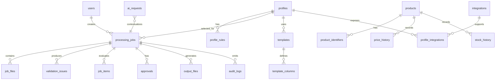

# Arquitetura de Dados (Schema) — Cotarco Commercial Manager

## 1. Princípios

- PostgreSQL como fonte de verdade do estado da aplicação.
- Supabase para PostgreSQL/Auth/Storage no MVP.
- Ficheiros binários no Storage; metadata no DB.
- IDs UUID.
- Timestamps `timestamptz`.
- Soft delete apenas onde houver necessidade real de auditoria.
- Campos de configuração flexível em `jsonb`, mas dados centrais continuam normalizados.
- Regras de domínio versionadas.

## 2. Modelo lógico



## 3. Tabelas

### `users`

Representação local do utilizador autenticado.

Campos:

- `id uuid pk` — alinhado com identidade do Auth quando possível;
- `email text unique not null`;
- `display_name text`;
- `role user_role not null default 'COMERCIAL'`;
- `is_active boolean not null default true`;
- `created_at timestamptz not null`;
- `updated_at timestamptz not null`.

### `commercial_profiles`

Perfil de finalidade/destino da tabela.

- `id uuid pk`;
- `code text unique not null` — exemplo `MANO`, `WOOCOMMERCE`, `BFA`;
- `name text not null`;
- `type text not null` — `STORE`, `MARKETPLACE`, `PARTNER`, `RESELLER`, `OTHER`;
- `description text`;
- `active boolean not null default true`;
- `config jsonb not null default '{}'`;
- `rules_version int not null default 1`;
- `created_at`;
- `updated_at`.

### `profile_rules`

Versão configurável das regras.

- `id uuid pk`;
- `profile_id fk`;
- `version int not null`;
- `rule_code text not null`;
- `rule_config jsonb not null`;
- `active boolean`;
- `created_at`;
- `created_by fk users`.

Unique recomendado: `(profile_id, version, rule_code)`.

### `templates`

Template de input/output.

- `id uuid pk`;
- `profile_id fk`;
- `name text`;
- `direction text` — `INPUT` / `OUTPUT`;
- `version int`;
- `storage_path text`;
- `schema jsonb`;
- `active boolean`;
- timestamps.

### `template_columns`

- `id uuid pk`;
- `template_id fk`;
- `column_key text`;
- `display_name text`;
- `required boolean`;
- `data_type text`;
- `aliases text[]`;
- `position int`;
- `rules jsonb`.

### `products`

Catálogo interno normalizado quando necessário para referência cruzada.

- `id uuid pk`;
- `canonical_reference text unique not null`;
- `name text`;
- `brand text`;
- `category text`;
- `active boolean`;
- timestamps.

### `product_identifiers`

Permite múltiplas referências por canal/fornecedor.

- `id uuid pk`;
- `product_id fk`;
- `namespace text not null` — `SAMSUNG`, `MANO`, `WOOCOMMERCE`, `INTERNAL`, etc.;
- `identifier text not null`;
- `normalized_identifier text not null`.

Unique recomendado: `(namespace, normalized_identifier)`.

### `processing_jobs`

Núcleo operacional.

- `id uuid pk`;
- `job_number bigint generated/sequence` para UX humana;
- `profile_id fk`;
- `created_by fk users`;
- `approved_by fk users nullable`;
- `status job_status`;
- `source_name text`;
- `source_system text`;
- `current_file_id uuid nullable`;
- `options jsonb not null default '{}'`;
- `summary jsonb`;
- `error_message text`;
- `started_at`;
- `completed_at`;
- `created_at`;
- `updated_at`.

### `job_files`

Versionamento dos ficheiros.

- `id uuid pk`;
- `job_id fk`;
- `kind text` — `INPUT`, `OUTPUT`, `LOG`, `REPORT`;
- `original_name text`;
- `storage_path text`;
- `sha256 text not null`;
- `size_bytes bigint`;
- `mime_type text`;
- `version int`;
- `uploaded_by fk users`;
- `created_at`.

### `job_items`

Resultado normalizado por referência.

- `id uuid pk`;
- `job_id fk`;
- `reference_original text`;
- `reference_normalized text`;
- `product_id fk nullable`;
- `old_price numeric(14,2)`;
- `new_price numeric(14,2)`;
- `old_stock integer`;
- `new_stock integer`;
- `price_variation_pct numeric(8,2)`;
- `decision text`;
- `decision_code text`;
- `details jsonb`;
- timestamps.

### `validation_issues`

- `id uuid pk`;
- `job_id fk`;
- `job_item_id fk nullable`;
- `severity text` — `INFO`, `WARNING`, `ERROR`, `BLOCKER`;
- `code text`;
- `message text`;
- `field text nullable`;
- `row_number integer nullable`;
- `details jsonb`;
- `resolved boolean default false`;
- `created_at`.

### `approvals`

- `id uuid pk`;
- `job_id fk`;
- `action text` — `APPROVED`, `REJECTED`, `CANCELLED`;
- `actor_id fk users`;
- `comment text`;
- `created_at`.

### `output_files`

Pode ser mantida separada de `job_files` se necessário para metadata específica; no MVP `job_files` pode ser suficiente. Se ambas existirem, evitar duplicação de source of truth.

### `price_history`

- `id uuid pk`;
- `product_id fk nullable`;
- `profile_id fk nullable`;
- `job_id fk`;
- `reference_normalized text`;
- `old_price numeric(14,2)`;
- `new_price numeric(14,2)`;
- `variation_pct numeric(8,2)`;
- `change_type text`;
- `recorded_at`;
- `recorded_by fk users`.

### `stock_history`

Estrutura equivalente para stock.

### `integrations`

Metadata da integração, sem guardar secrets em texto.

- `id uuid pk`;
- `code text unique`;
- `name text`;
- `kind text`;
- `enabled boolean`;
- `secret_ref text nullable`;
- `config jsonb`;
- timestamps.

### `profile_integrations`

- `profile_id fk`;
- `integration_id fk`;
- `enabled boolean`;
- `config jsonb`.

### `ai_requests`

- `id uuid pk`;
- `job_id fk`;
- `user_id fk`;
- `purpose text`;
- `model text`;
- `request_schema_version text`;
- `input_hash text`;
- `response jsonb`;
- `status text`;
- `latency_ms integer`;
- `created_at`.

Não guardar dados comerciais sensíveis desnecessariamente no prompt/log.

### `audit_logs`

- `id uuid pk`;
- `actor_id fk nullable`;
- `action text`;
- `entity_type text`;
- `entity_id uuid nullable`;
- `job_id fk nullable`;
- `metadata jsonb`;
- `ip_hash text nullable`;
- `user_agent text nullable`;
- `created_at`.

## 4. Enums mínimos

```sql
create type user_role as enum ('COMERCIAL', 'OPERADOR', 'ADMIN');
create type job_status as enum (
  'UPLOADED',
  'VALIDATING',
  'READY_FOR_REVIEW',
  'NEEDS_CORRECTION',
  'APPROVED',
  'PROCESSING',
  'COMPLETED',
  'FAILED',
  'CANCELLED'
);
```

## 5. Índices importantes

```sql
create index idx_jobs_profile_status on processing_jobs(profile_id, status);
create index idx_jobs_created_by on processing_jobs(created_by, created_at desc);
create index idx_job_files_job on job_files(job_id, created_at desc);
create index idx_job_items_job_ref on job_items(job_id, reference_normalized);
create index idx_validation_job_severity on validation_issues(job_id, severity);
create index idx_price_history_ref_date on price_history(reference_normalized, recorded_at desc);
create index idx_audit_entity on audit_logs(entity_type, entity_id, created_at desc);
```

## 6. RLS / autorização

Mesmo usando FastAPI como camada principal, habilitar RLS onde apropriado como defesa em profundidade.

Princípio:

- Comercial lê apenas os próprios jobs/arquivos permitidos;
- Operador lê jobs necessários para operação;
- Admin pode gerir configurações;
- nenhuma policy deve permitir acesso anónimo a dados comerciais.

A autorização de caso de uso deve existir também no backend; RLS não é a única barreira.

## 7. Integridade de ficheiros

Para cada input:

`bytes → SHA-256 → Storage → metadata no DB`.

O hash deve ser usado para detectar reuploads idênticos, duplicações e rastreabilidade.

## 8. Retenção

Definir política com a empresa antes de produção. Para o MVP, configurar retenção suficiente para demonstração e testes e parametrizar o comportamento.
